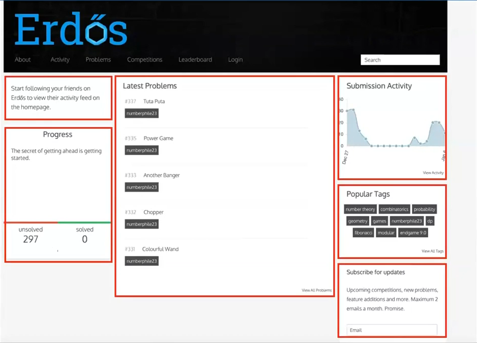

### React Component Return
**A react component can only return a single top level xml.**
Never we can return multiple children/siblings.

**Why?**
1. Makes it easy to do **reconciliation** (process of figuring out what DOM updates have to be done)

#### Todo 1
Create a react app that has a Header component that takes a title as a prop and renders it inside a div. The top level app component renders 2 Headers.

```jsx
function app() {
    return ( // Can not have two children
        <Header title="my name is kidrah" />
        <Header title="My name is hardik" />
    )
}
function Header({title}) {
    return <div>
        {title}
    <div>
}
export default App
```
Note:
* The `<Header>` component even if it seems like a HTML but it is a XML.
* There should be only on child to the return so we can add parent to the return by
1. Using Empty tags `<>` and `</>`, this doesn't add extra DOM element.
2. Using `<React.fragment> </React.fragment>` where `import React from "react"`
* We can render multiple Headers but all need to have single parent, so the app return just a single entity.


## React Re-rendering
After any DOM manipulation happens, react re-renders the component.
Anytime the React actually updates the DOM is called re-rendering.
Also, when we change a component then all its child gets re rendered.

`Please install React developer tools to visualize it`

**Minimize Re-Renders**, because while scaling this gets expensive.

#### Todo 2
Allow user to update the title of the first Header with a new one.
May be use Math.random() to create a new number.

```jsx
function App() {
  const [newString, setString] = useState("Random");
  function updateTitle () {
    setString("My name is " + (Math.floor(Math.random()*100)));
  }
  return ( <>
      <button onClick={updateTitle}>Click Me</button>
      <Header title={newString} ></Header>
      <Header title={newString} ></Header>
      <Header title="Hello" ></Header>      
    </>
  )
}
function Header({title}) {
  return <div>
    <br></br>
    {title}
  </div>
}
```

Now what exactly is changing? The button and title which prints random numbers.
But unintentionally the static text "Hello" also gets re-rendered.
**To check Inspect-> Components -> Settings - Highlight when component reloaded**
Now when you click on button all the components gets rerendered. (blue box highlight)
Also if a child get re-rendered the parent should/is technically is re-rendering.

### What a re-render means:
* **React did some work to calculate what all should update in this component**
* **The component actually got called (you can put a log to confirm this)**
* **The inspector shows you a bounding box around the component.**

### It happens when
**1. A state variable that is being used inside a component changes**
**2. A parent component re-render triggers all children re-rendering.**

**You want to minimize the number of re-renders to make a highly optimal react app.**
**The more the components that are getting re-rendered, the worse**


#### How can we minimize the number of re-renders in this app?
**1. Push the state down**
**2. React.memo** 

#### Todo 3: Push the state down
Here we structure the code/components to solve the issue.
```jsx
function App() {
  const [count, setCount] = useState(0)
  return (
    <div>  
      <HeaderWithButton />
      <br></br>
      <Header title="This is a static header, will not re-render" />
    </div>
  )
}
function Header({title}) {
  return <div> {title} </div>
}
function HeaderWithButton() {
  const [firstTitle, setTitle] = useState("Default Title");
  function changeTitle() {
    setTitle("New title is " + Math.floor(Math.random() * 100));
  }
  return <>
    <button onClick={changeTitle}>Click me</button>
    <br></br>
    <Header title={firstTitle} />
  </>
}
```
So now only HeaderWithButton Re-renders now.
Because all the state variable are enclosed inside a component instead of App.
So **push down state variables down the chain**, where the states are used.
i.e. if in hierarchy of parent children, and the last children in chain needs the state component, keep it to its just ancestor, so if state changes only the parent of the last child rerenders.
Also this was the reason why whole app was re-rendering, because state variable was in the root/App component


#### Todo4: Using React.memo
(https://react.dev/react/memo)
Basically memo lets us skip re-rendering components when its props are unchanged.

```jsx
function App() {
  const [title, setTitle] = useState("Hi, who are you?")
  function changeTitle() {
    setTitle("Hello agent "+Math.floor(Math.random() * 100));
  }
  return ( <div>
      <button onClick={changeTitle}>Click Me</button>
      <Header title={title}></Header>
      <Header title="Update profile 1"></Header>
      <Header title="Update profile 2"></Header>
      <Header title="Update profile 3"></Header>
      <Header title="Update profile 4"></Header>
      <Header title="Update profile 5"></Header>
      <Header title="Update profile 6"></Header>
    </div>
  )
}
/* One way */
// const Header = React.memo(function Header({title}) {
//   return <div>
//     {title}
//   </div>
// });
/* Second Way */
function header({title}) {
  return <div>
    {title}
  </div>
}
const Header = memo(header);

```
Here root/App has changed because state variable is inside app, but the other components inside that were not changed are not re-rendered.


## Keys in React (Todo5)
Lets create a simple todo app that renders 3 todos.
* Create a Todo Component that accepts title, description as input
* Initialize a state array that has 3 todos
* Iterate over the array to render all the Todos
* A button in the top level app component to add a new Todo

```jsx
function App() {
  const [todos, setTodos] = useState([
    {id:1, title: "Title1", description: "Description of Title1"},
    {id:2, title: "Title2", description: "Description of Title2"},
    {id:3, title: "Title3", description: "Description of Title3"},
  ])
  function addTodo() {
    const newId = Math.floor(Math.random() * 100);
    setTodos([...todos, {
      id: newId,
      title: newId + "",
      description: "This is a description"
    }]);
  }
  return (
    <div>
      <button onClick={addTodo}>Add a todo</button>
      {
        todos.map((item)=> {
          return <Todo key={item.id} title={item.title} description={item.description}></Todo>
        })
      }
    </div>
  )
}
function Todo({title, description}) {
  return <div>
    <h1>{title}</h1>
    <h3>{description}</h3>
  </div>
}
```
Note: Gives a **error** `Warning: Each child in a list should have a unique 'key' prop.`

**Keys**: keys tell React which array item each component corresponds to, so that it can match them up later. This becomes important if your array items can move (eg. due to sorting), get inserted, or get deleted. A well-chosen `key` helps React infer what exactly has happened and make the correct updates to the DOM tree.
Rather than generating keys on the fly you should include them in your data.
**Key unique must always be given**, because it makes a huge difference for react for optimization. Basically in order to create div's as a part of optimization or in order to find the change, React will be confused a lot and may take lot of time.
Eg. If while processing if ordering is changed it will refer the id and reorder or re-render in optimistic way. Even if the key is not being used.

# Wrapper Components

You can create a wrapper card component that takes the inner React component as an input.

These are cards that look same and each card have a react component inside.

So Wrapper Component (Another Component)

#### Todo6_wrapper
```jsx
function App() {
  return <div>
    <CardWrapper innerComponent={<TextComponent />}></CardWrapper>
    <CardWrapper innerComponent={<TextComponent2 />}></CardWrapper>
  </div>
}
// function TextComponent() {
//   return <div>
//     Hi there
//   </div>
// }
// function TextComponent2() {
//   return <div>
//     Hello there
//   </div>
// }
function CardWrapper({innerComponent}) {
  return <div style={{border:"2px solid black"}}>
    {innerComponent}
  </div>
}
```
This wrapper is just for understanding, in real we will usually use 

```jsx
function App() {
  return <div>
    <CardWrapper>
      Hi There 
    </CardWrapper>
  </div>
}
function CardWrapper({children}) {
  return <div style={{border:"2px solid black", padding: 20}}>
    {children}
  </div>
}
```
Note: `children` even if not passed it is provided.

# Popular Hooks
**Hooks in React are functions that allow you to "hook into" React state and lifecycle features from function components.
These functions that start with `use` are called hooks
Popular ones are `useState`, `useEffect`, `useMemo`, `useCallback`, `useRef`, `useContext`, `useLayoutEffect`, etc.

**mount**: when a component is first time loaded in the dynamic web page. Not when component changes and page re-renders the component, only when the component is loaded for the first time is what we call mount
**Note: argument to hooks can not be async function**
### useEffect 
It allows us to add action to a component when it mounts. `useEffect(callback, [])`
Dependency array if empty means runs only on first mount.
```jsx
function App() {
  useEffect(()=> {
    fetch("a link")
    .then(async (res) => {
      const json = await res.json();
      setTodos(json.todos);
    })
  }, []); // Dependency Array
}
```

#### Todo7_hooks
Create an app that polls the sum server, gets the current set of TODOs (GET http://sum-server.100xdevs.com/todos). Renders it on screen.


## Side Effects
In React, the concept of side effects encompasses any operations that reach outside the functional scope of a React component.
These operations can affect other components, interact with the browser, or perform asynchronous data fetching.
eg. setTimeout, fetch, setInterval, document.getElementById("").innerHTML = ""

## Hooks
Hooks are a feature introduced in React 16.8 that allow you to use state and other React features without writing a class.
They enable functional components to have access to stateful logic and lifecycle features, which were previously only possible in class components,
This has led to a more concise and readable way of writing components in React.

Some common hooks are `useState`, `useEffect`, `useCallback`, `useMemo`, `useRef` and `useContext`.

# useState
Lets us describe the state of our app. Whenever state updates, it triggers a re-render which finally results in a DOM update.
```jsx
function App() {
  const [count, setCount] = useState(0)
  return <div>
    <button onClick={function () {setCount(count + 1);}}>Click Me </button>
  </div>
}
```

# useEffect
The `useEffect` hook is a feature in React, a popular JavaScript library for building user interfaces. It allows you to perform side effects in function components.
**Side effects** are operations that can affect other components or can't be done during rendering, such as data fetching, subscriptions, or manually changing the DOM in React components.
The `useEffect` hook serves the same purpose as `componentDidMount`, `componentDidUpdate` and `componentWillUnmount` in React class components, but unified into a single API.

```jsx
function App() {
  const [todos, setTodos] = useState([]);
  useEffect(() => {
    fetch("ToGetDataorTodos/todos")
    .then(async (res)=> {
      const jsonData = await res.json();
      setTodos(json.todos);
    })
  }, []);

  return <div>
    {todos.map(todos => <Todo key={todo.id} title={todo.title} description={todo.description} />)}
  </div>
}
```
**Dependency Array**: Second argument of useEffect() i.e. `[]` an empty array indicates do it only once, we can even use this to simulate when side effect should execute.
Can also say, When should the callback fn or side effect run?
It takes `state variable` as input, and whenever the state variable updates it will call the side effect.

#### Todo8_useEffect


# useMemo
The term **memoization** means remembering some output given an input and not computing it again. Similar to caching.
So tasks that are mildly expensive (side effects), we do them maybe after some time not every sec or every render. In such cases we use useMemo.

#### Todo9_useMemo
Create an app that does two things
1. Increase a counter by 1
2. Lets user put a value in an input box (n) and you need to show sum from 1-n
But everything needs to be inside App
```jsx
function App() {
  const [counter, setCounter] = useState(0)
  const [textValue, setTextValue] = useState(1);

  let count = 0;
  for(let i = 1; i <= textValue; i++) {
    count = count + i;
  }

  return (
    <>
      <input type="text" id="TextBox" onChange={(e)=>{
        setTextValue(e.target.value)
      }} />
      <h1>Sum of 1 to {textValue} is {count}</h1>
      <button onClick={()=>{setCounter(counter+1)}}>Counter ({counter})</button>
    </>
  )
}
```
now here whenever input is given, the app gets re-rendered and value is again generated. This is Ok.
But when counter is incremented, even if the input value is not changed the expensive operation of calculating sum is done again. This is the problem.

One way to fix it is create a additional state variable for input and useEffect. So whenever the input changes only then calculate the sum.
This is a good approach, but to calculate sum we are adding extra layer or rendering, i.e. first the input gets updated and then the counter. And also a extra state variable.

So we want something like update the count only when a particular state variable changes.
```jsx
function App() {
  const [counter, setCounter] = (0);
  const [textValue, setTextValue] = (1);

  let count = useMemo(()=> {
    let sum = 0;
    for(let i =1; i< {textValue}; i++) {
      sum += i;
    }
    return count;
  }, [textValue]);
  return (
    <>
      <input type="text" id="TextBox" onChange={(e)=>{
        setTextValue(e.target.value)
      }} />
      <h1>Sum of 1 to {textValue} is {count}</h1>
      <button onClick={()=>{setCounter(counter+1)}}>Counter ({counter})</button>
    </>
  )
}
```

# useCallback
`useCallback` is a hook in React, a popular javascript library for building user interfaces. It is used to memoize functions, which can help in optimizing the performance of your application, especially in cases involving  child components that rely on `reference equality` to prevent unnecessary renders.

Now, what is a state variable?  how is it different from normal variable? 
So state variable is something that have reference equality across the function.
What do we mean by `reference equality`? Basically if address of two variable is same that means both are pointing to the same value and hence they are equal we don't need to actually check the values. They are equal by reference.
Eg. a= 1, b =1, a==b  true
Eg. a = "123", b = "123" a==b true
eg. a = {}, b = {} a==b false
Eg. function a () { console.log("Hi")}, function b() {console.log("Hi")}, a==b False
React calculates difference in value of state variable using some other mechanism. But if normal variable is used, it checks for reference equality.
Lets say we used memo to memoize a normal variable, so how does react know if the value is changed? Using reference equality. a == b is false that means value updated.

But for functions with same arguments, even if they are same but a == b will always be false. 

Hence useCallback.

#### Todo10_problemWhyUseCallback
Just a code
```jsx
function App() {
  const [count, setCount] = useState(0)

  function logSomething() {
    console.log("Child Clicked");
  }

  return <div>
    <Child inputFunction={logSomething} />
    <button onClick={() => {
      setCount(count + 1);
    }}>Click me</button>
  </div>
}

const Child = memo(({inputFunction}) => {
  console.log("Child render");

  return <div>
    <button onClick={inputFunction}>Button Clicked</button>
  </div>
})
```
What was memo? If we put a component in memo, even if parent re-renders this being child only renders when changed and not when parent change.
We passed a raw function as a input to memo. Function is constant, so even if parent renders, memo being used, child should not render.
But here comes `reference equality` and two function can not be equal. So it will re-render when parent re-renders.
This is the problem, because react will not know that function is not changed.

Hence we use useCallback. And the dependency array is checked to see if the function needs to be re-rendered.
```jsx
function App() {
  const [count, setCount] = useState(0);
  function logSomething() {
    console.log("Child Clicked");
  }
  const inputFunction = useCallback(()=>{
    console.log("Hi There");
  }, []);
  return <div>
    <Child inputFunction={logSomething} />
    <Child inputFunction={inputFunction} />
    <button onClick={() => {
      setCount(count + 1);
    }}>Click me</button>
  </div>
}
const Child = memo(({inputFunction}) => {
  console.log("Child render");

  return <div>
    <button onClick={inputFunction}>Button Clicked</button>
  </div>
})
```
Now the 2nd child button doesn't re-renders.


# Custom Hooks
Just like useState, useMemo, useEffect, etc we can also create custom hooks.
`Only Condition is, it should start with a use (naming convention)`
