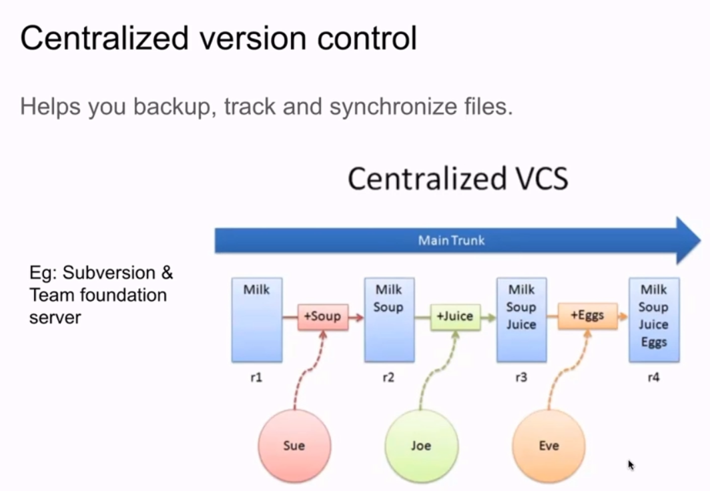
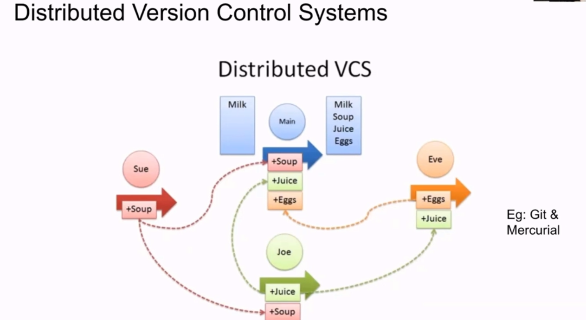
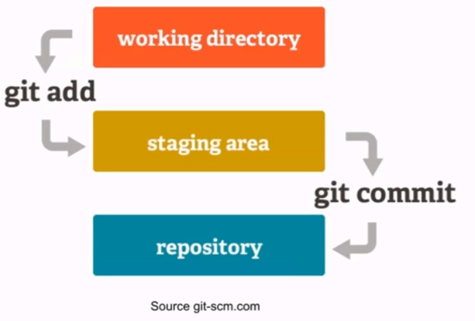

# Version Control System

Free and open source version control system.

### What is version control system?
* A system that keeps track of our files or projects.
* It allows you to revert selected files to a previous state, **revert** the entire project to a previous state, **compare changes** over time, see who last modified something so that we can know what might be causing a problem, or **what** is the issuem **who** made it, and **when** with the details.

### Version control System (VCS) are of 2 types


So here in centralized all the changes are to maintained in a single server, all changes are global and seen to all.
Changes made by one is seen by all.
But kind of problematic, as if a fault is made by whole system goes down.
All time network connectivity is required to make changes.
Basically all are working on different part of project and are merging continuously.
All members are dependent on each other.


So here all the members have a local code base, and whenever changes are to be updated for all we have connect to server and update for all.
So even if code doesnt run on one system, it wont affect others.
All members can work independently.

## Why GIT?
* Free, and open source
* Scalable
* Super fast
* Cheap branching and merging

## What is GitHub?
GitHub is a **web-based hosting service** for git repositories.
You can use git without GitHub, but not vice versa.

| GIT | GitHub |
|---- | ------ |
| Used for Version Control   |   Used for hosting GIT repositories |
| Installed Locally on computer | Cloud Based |
| Tracks changes made to a file | Provides a web interface to view file changes |


### Terminologies

**1. Local Repository:**
Every VCS tool provides a private workplace as a working copy. Developers make changes in their private workplace and after commit, these changes become a part of the repository.
Git Takes it one further by providing them a private copy of the whole repository.
Users can perform many operations with this repository such as add file, remove file, rename file, move file, commit changes and many more.

**2. Working Directory and Staging Area or Index:** 
An intermediate area where commits can be formatted and reviewed before completing the commit.

**3. push:**
Send a Change to another repository [May require permission]

**4. pull:**
Grab a change from a repository.


### Basic work flow of GIT

Step 1: You modify a file from the (local) working directory.
Step 2: You add these files to the staging area.
Step 3: You perform commit operation that moves the files from the staging area. After push operations it stores the changes permanently to the git repository.



## Blobs
Blob stands for **Binary Large Objects**. Each version of a file is represented by blob.
A blob holds the file data but doesn't contain any metadata about the file.
It is a binary file, and in Git database, it is named as **SHA1** hash of that file.
**In Git, files are not addressed by names. Everything is content-addressed.**

## Trees
Tree is an object, which represents a directory. It holds blobs as well as other sub-directories.
A tree is a binary file that stores references to blobs and trees which are also named as **SHA1** hash of the tree object.

## Commit
* Commit holds the current state of the repository. A commit is also named by SHA1 hash.
* Commit object = a node of the **linked list.**
* Every commit object has a pointer to the parent commit object.
* From a given commit, you can traverse back by looking at the parent pointer to view the history of the commit.
* If a commit has multiple parent commits, then that particular commit has been created by merging two branches.

## Git commands

**Clone**: Bring a repository hosted somewhere like Github into a folder or your local machine.
**Add**: Track your files and changes in GIT. (i.e. add in staging area/index)
**Commit**: Save your files in git.
**Push**: Upload your commits to a git repo, like GitHub.
**Pull**: Download changes from a remote repository to your local repository.

> Note we can always use github as a interface for all these below commands.


### install git
> https://www.atlassian.com/git/tutorials
```terminal
$ sudo apt-get install git
$ git config --global user.name "hardikshah"
$ git config --global user.email "hardikshah@gmail.com"
```

* git init
Initialises a workspace with git. i.e. from scratch. If already repository is present on git use git clone.

* git status: 
Check the current status of GIT, i.e. if there is any problem or issue in directory.

* git add .
Git copy or basically add all the files to local repository or staging state.
Not yet uploaded for global repository, kind of in the middle.
Here we can pull the changes of others and check if error occurs before uploading/pusing to git global repository.
Before running this command, try git status and we can see all the files that are not yet added to staging step. And after adding them they will look different.(green)

* git rm --cached fileName
If you want to remove a file that you dont want to upload to git global repository, then we can remove it.

* git commit -m "Message for the changes like a comment for everyone to read"
Local repository for all the files to in future upload on git.

* git remote -v
Here we can check the actual global link where we want to commit, if nothing is seen we can add them using ->

* git remote add origin https://githublink.git
To add the git repository link. (add .git at the end)

* git push --set-upstream origin master
or 
* git push origin master
* git clone
* git commit -ma


adding ssh authentication to linux terminal
ssh-keygen -t rsa -b 4096 -C "your_email@example.com"
    give file name
    (optional) give passphrase


