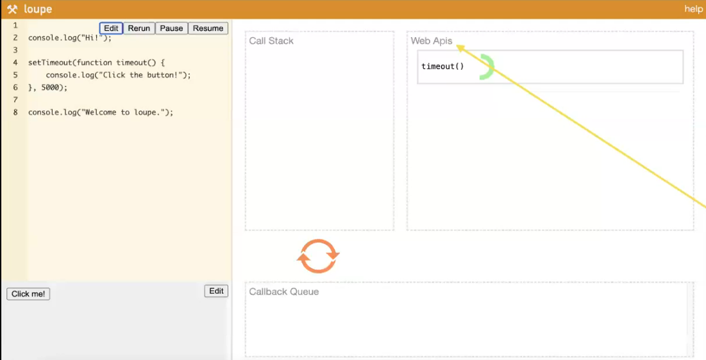
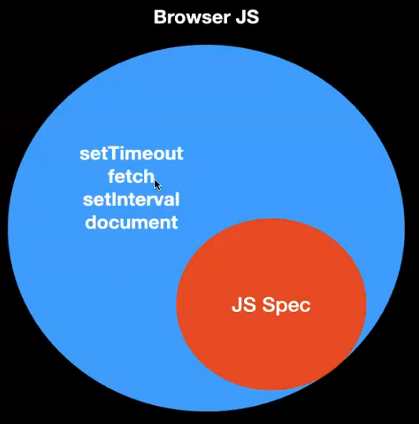

# DOM (Document Object model)

**A little history**
#### **What was Javascript?**
It was an implementation of the **ECMAScript spec**.

#### **ECMA Scripts**
ECMAScript, often abbreviated as **ES**, is **a scripting language specification** that serves as the **standard upon which JavaScript is based**. Basically, consider them as a set of rules and guidelines that make sure JavaScript behaves in a certain way. It's like a manual that tells developers what features JavaScript should have and how it should work.

So refering the ECMA Scripts, some genius people created Javascript.

Now developers of **Chrome** created a compiler/browser called **JS engine(V8)** that took the JS code and converted into byte code, that ran on browser. Similarly other browsers like Firefox, Safari, etc also created their own compilers/browsers.

**But the Javascript that runs in browser has some extra functionality**
Like Call **Web Apis**, **Callback queue**, etc. (refer [Loupe](http://latentflip.com/loupe/))
And functions like `setTimeOut()` were not mentioned in ECMA script.



#### **Auxiliary APIs**
Auxiliary APIs, in the context of web development, refer to **additional interfaces** and **functionalities** provided by **browsers or runtime environments** beyond the core JavaScript language (as specified by ECMAScript). These **APIs** extend the capabilities of JavaScript, **enabling developers to interact with various aspects of the browser environment or perform tasks that go beyond the language's basic features**.



Some examples:
1. **Node.js APIs:**
In the context of server-side JavaScript using Node.js, there are APIs specific to Node.js that provide access to the file system `fs`, networking `http`, and other server-related functionalities.

2. **Third-Party APIs:**
APIs provided by external services or libraries that developers can use to enhance their applications. Examples include Google Maps API, Twitter API, or any other API that allows integration with external services.

#### **Web APIs:**
These are **browser-specific** APIs that provide additional functionality to JavaScript for interacting with the browser environment. Examples include the **DOM (Document Object Model), Fetch API for making network requests, and the Web Storage API for local storage.**

These APIs are not part of the JavaScript language specification (ECMAScript) but are essential for building web applications, interacting with external services, and handling server-side operations. They extend the capabilities of JavaScript in specific environments.

**DOM is just `document` web-api to interact with the elements of (HTML) document**

## `document`
In JavaScript, the Document refers to the root object of the DOM. 

**The DOM (Document Object Model) API is a programming interface for web documents. It represents the page so that programs can change the document structure, style, and content. The DOM represents the document as a tree of objects; each object represents a part of the page.**

The `document` object provides an entry point to the DOM, and it represents the entire HTML or XML document. Developers can use methods and properties provided by the `document` object to interact with and manipulate the content of a web page dynamically.

Example: **Lets create a simple website to calculate the sum of two numbers**
(refer `01_simple_static_website`)

Now making the website **Dynamic** is tough. i.e.
1. Changing the elements on the website once the website is loaded
2. Actually calculating the sum based on the inputs and **rendering** it back on the screen.

#### class vs id
Lets say we want to have similar divs in two places
```html
<body>
    <div style="background-color: red; margin: 10px; padding: 10px;">
    hi there
    </div>
    <div style="background-color: red; margin: 10px; padding: 10px;">
    hi there 2
    </div>
</body>
```
So the **DRY** principle gets voilated. We repeated the style for both.
Thats when we use **class**
```html
<style>
    .container {
        background-color: red; margin: 10px; padding: 10px;
    }
</style>
<body>
    <div class="container"> hi there </div>
    <div class="container"> hi there 2  </div>
</body>
```
But we need something to get only the second div, how to differentiate between them? **id**
**id are supposed to be unique. They are used to uniquely identify a div/span/input/button**
```html
<div class="container" id="container1">hi there</div>
<div class="container" id="container2">hi there</div>
```
Note: we can even style based on id. **But it is considered as bad practice**. 
```html
<style>
    #container1 {
        background-color: red; margin: 10px; padding: 10px;
    }
    #container2 {
        background-color: red; margin: 10px; padding: 10px;
    }
</style>
<body>
    <div class="container" id="container1">hi there</div>
    <div class="container" id="container2">hi there</div>
</body>
```
* **Also we can assign same id to different objects (div/span/input/button)**. Also a bad practice, yet JS wont say anything.
* **Id are important because they let you access elements via the DOM API.**


### Manipulating HTML with JS
The DOM (Document Object Model) API **allows JavaScript to manipulate the HTML** of a web page. 

Imagine the DOM as a tree-like structure that represents your HTML document. Each element in your HTML, like buttons, paragraphs, and images, is a part of this tree. JavaScript can interact with this tree, changing, adding, or removing elements. It's like giving JavaScript the power to update what you see on a webpage.

(refer `02_simple_dynamic_website`)

### Methods to Select Elements
1. **querySelector()**:
querySelector() is a method that selects the first element that matches a specified CSS selector.
Syntax: `document.querySelector('selector')`
Example: In this example, `querySelector('#example')` selects the element with the ID "example," and the text color is changed to blue.
         

2. **getElementById()**:
getElementById() is a method that selects a single element by its ID attribute.
Syntax: `document.getElementById('id')`
Example: In this example, getElementById('example') selects the element with the ID "example," and the text color is changed to red.
        

3. **getElementsByClassName()**:
getElementsByClassName() is a method that selects all elements with a specific class name.
Syntax: `document.getElementsByClassName('class')`
Example: In this example, getElementsByClassName('highlight') selects all elements with the class "highlight," and their font weight is changed to bold.
         

**Relationship**:
All three methods are used to select and manipulate HTML elements.
* **getElementById()** is specifically for selecting by ID.
* **getElementsByClassName()** selects by class name, but it returns a collection of elements.
* **querySelector()** is more flexible as it can select by any valid CSS selector and returns the first matching element.

