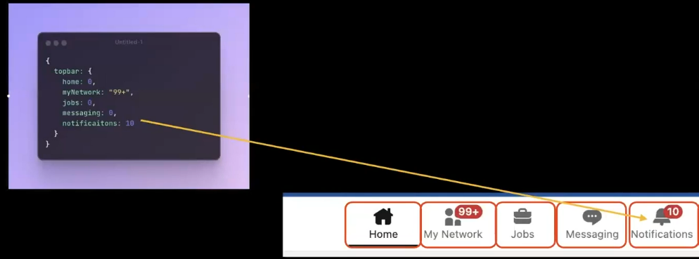
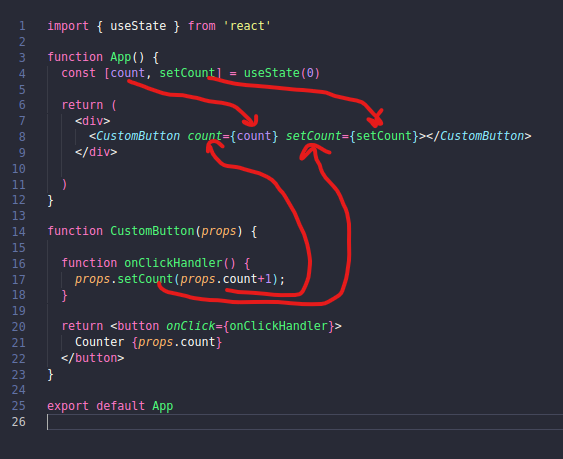

# REACT

**Static websites** are those websites whose content doesnt change once the website is loaded.
**Dynamic websites** are those websites whose content changes even after the website is loaded and not refreshed. Like clicking a button makes a content of page change.

We can definelty create static and dynamic webistes without using libraries like React, Vue, etc. but these libraries makes our life much easier.
One such feature of making website dynamic is **DOM Manipulation** which can be done simply by using JS as well. But as we saw even to update a simple content it takes lot of time and effort. (ref Todo App).
So libraries like React makes it easier and also many more reasons.

**React is just an easier way to write normal HTML/CSS/Javascript. Its a new syntax, that under the hood gets converted to HTML/CSS/JS**

**`[React] --> (npm run build) --> [HTML/CSS/JAVASCRIPT]`**

#### Why React?
* People realised its harder to do DOM manipulation the conventional way.
* There were libraries that came into the picture that made it slightly easy, but still for a very big app its very hard (JQuery)
* Eventually, VueJS/React created a new syntax to do frontends
* Under the hood, the react compiler convert your code to HTML/CSS/JS.

**Example of traditional approach**
A simple button that increments counter when clicked
```html
<script>
    function onButtonPress() {
        const currentValue = document.getElementById("btn").innerHTML;
        console.log(currentValue.split(" "));
        const currentCounter = currentValue.split(" ")[1];
        const newCounter = parseInt(currentCounter) + 1;
        document.getElementById("btn").innerHTML = "Counter" + newCounter;
    }
</script>
<body>
    <button onclick="onButtonPress()" id="btn">Counter 8</button>
</body>
```
`Exapmle 01_simpleDomManipulation_button.html`
But this is simple task yet soo much code to write, also as the functionality increases this gets harder and harder.

### React jargons
## State
**An javascript object** that represents the current **state** of the app.
It represents the dynamic things in your app (things that changes)
For example, value of the counter.
Example of State
```state
{
    count: 1
}
```
Example: LinkedIn Top bar, it could be something like this
```state
{
    topbar : {
        home: 0,
        mynetwork: "99+",
        jobs: 0,
        messaging: 0,
        notification: 10
    }
}
```
Now if changing any value in this state updates the front end DOM elements automatically.

## Components
**It is a re-usable, dynamic, HTML snipped that changes given the state**
How a DOM element should render, given a state.
Example: For the above LinkedIn Top bar state, what part of document should update/reflect is the component for the state.

So if the state is updated, the components get updated.


## Re-rendering
A state change triggers a **re-render**
A **re-render** represents the actual DOM being manipulated when the state changes.

Basically when to check for the state, and valuate if the values are changed or not, based on which dom will be updated is re rendering.
**In React, when the state changes, React automatically re-renders the component to reflect that change. This way, your users always see the most up-to-date and accurate information on the screen.**

## Vitrual DOM
React uses a virtual DOM to optimize updates and improve performance. The virtual DOM is an in-memory representation of the actual DOM elements. It's a lightweight copy of the real DOM
When you make changes to the state of a React component, React creates a new virtual DOM tree representing the updated state.
React then compares the new virtual DOM with the previous virtual DOM to determine the differences (diffing)
The differences are used to compute the most efficient way to update the real DOM

## Real DOM
The real DOM is the actual browser's Document Object Model, representing the structure of the HTML document.
When React determines the updates needed based on the virtual DOM diffing process, it updates the real DOM with only the necessary changes.
Manipulating the real DOM can be expensive in terms of performance, so React aims to minimize direct interaction with it.

**In summary, while there are two representations—virtual DOM and real DOM—React abstracts the complexity of direct manipulation of the real DOM by using a virtual DOM and efficiently updating only the parts that have changed. This approach contributes to React's efficiency and performance in managing UI updates.**

Without using React lets see the flow of state, component and re-rendering
`Example 02_replicatingReact.html`
```html
<body>
    <div id="buttonParent"></div>
</body>
<script>
    // state initalisation
    let state = {
        count: 0
    }
    /* Defining the button componenet*/
    function onButtonPress() {
        state.count++;
        buttonComponentReRender();
    }
    /* Re-renderer */
    function buttonComponentReRender() {
        document.getElementById("buttonParent").innerHTML = ""; // clearing out
        const componenet = buttonComponent(state.count);
        document.getElementById("buttonParent").appendChild(componenet);
    }
    /*  /* Defining the button componenet, Component that represents the state */
    function buttonComponent(count) {
        const button = document.createElement('button');
        button.innerHTML = `Counter ${state.count}`;
        button.setAttribute("onclick", `onButtonPress()`);
        return button;
    }
    /* First time rendering is must */
    buttonComponentReRender();
</script>
```

Just for reference ->
Note: **array destructuring**
```javascript
const arr = [1, 2];
const [a, b] = arr;
```
so `a is 1` and `b is 2`.
Similarly **object destructuring**
```javascript
const { name } = {
    name: "hardik",
    age:27
}
```
so `name is "hardik"`


Lets create the above button app using **React**
1. Create a folder ('03_simpleButton_react')
2. Open terminal in that folder, do following to create the workspace
```terminal
$ npm create vite@latest
? Project name: simpleCounterApp
? Package name: simplecounterapp
? Select a framework: React
? Select a variant: Javascript
$ cd simpleCounterApp
$ npm install
```
3. To run the code 
```terminal
$ npm run dev
```
4. File structure
* `index.html` in main folder, has type as "module" and src as "/src/main.jsx"
```html
<body>
    <div id="root"></div>
    <script type="module" src="/src/main.jsx"></script>
</body>
```
* `jsx` is just a javascript file, in which we can **write both JS and XML**. (not HTML)
* Inside `/src/main.jsx`
```jsx
ReactDOM.createRoot(document.getElementById('root')).render(
  <React.StrictMode> // remove this 
    <App />
  </React.StrictMode>, // remove this
)
```
So here it says, `createRoot` using the `root` that we created as `div` in `index.html`, render `<App />` here.
* So app is `App.jsx`
```jsx
function App() {
  const [count, setCount] = useState(0)

  return (
    <>
  
    </>
  )
}
export default App
```
So this is what gets rendered on `index.html` at `<div id="root">` 

Now try putting text there and checkout the output using `$ npm run dev`.

Now we know that everything react does is then converted back to HTML/CSS/Javascript for browser to render.
So to check it out by yourself
`$ npm run build`
Run this command and a dist folder with index.html will be created. Check it out.
This dist folder if hosted on AWS is a fully functioning website.
To check it out or run, go in dist folder and 
`$ python3 http.serve 8080` then just go to `http://0.0.0.0:8080`

So simple button code is `App.jsx`
```jsx
// import './App.css'

import {useState} from "react";

// global state 
// let state = {
//   count: 0
// }

function App() {
  // define initial state
  // 1st argument: created a count variable, and gave a initial value of 0
  // 2nd argument: returned a function that will be used as a re-renderer whenever we want
  const [count, setCount] = useState(0);   // returns two values, [0 1] so count becomes 0 and setCount becomes 1 kindof
  
  function onClickHandler() {
    setCount(count + 1); // we want that on click count should be incremented and button to be re-rendered.
  }
  return (
    <div>
      <button onClick={onClickHandler}>Counter {count}</button> 
      {/* this is a JSX i.e. XML and JS, so here we dont call like we did in HTML
      In HTML: <button onclick="onClickHandler()">
      Nope, here we just passed the function name that is supposed to be called when someone clicks on the button */}
    </div>
  )
}

export default App
```

Also



### IMP POINTS
1. Use { } to write JS under jsx
2. If the parent get re-rendered all the child components get re-rendered.
3. When we are creating the hook `const [todo, setTodo] = React.useState({obj});` is basically assigning the `obj` to `todo`, and `setTodo()` is the re-render. So react doesnt look on `todo` if it is changed, it is when `setTodo(new value)` is called, react re-renders the object with what we pass to setTodo and assigns the same back to `todo`.
4. Never update the state variable i.e. `todo`, always use the function with new values i.e. `setTodo(newValues)`
5. In react jsx files basically we are creating functions 
```js
function Sum (a, b) { // inital capital
  // normal function
}
```
But in jsx
```jsx
<Sum a={1} b={2} />

function Sum(props) {
  props.a // is how we read arguents

  return <div>
      {/* returns HTML */}
    </div>
}
```
6. props is basically properties.
