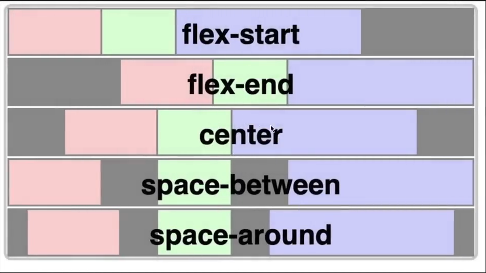
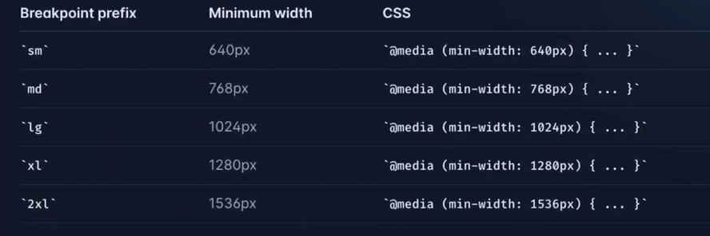
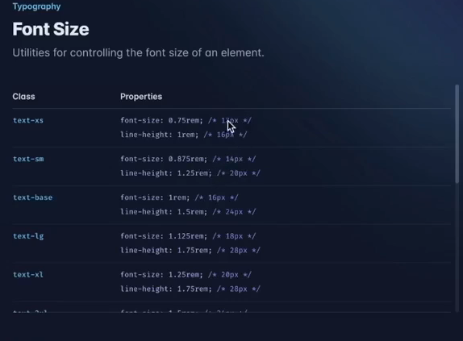
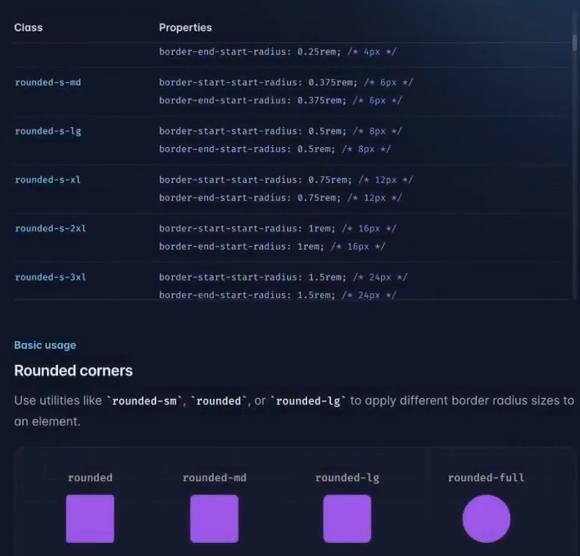

# Youtube Clone

**Things to know in a frontend framework**
1. Flex
2. Grids
3. Responsiveness
4. Background color, text color, hover, etc.

# Flex


Example:
```jsx
export default function Test() {
    return (<div style={{display:"flex", justifyContent:"space-between"}}>
        <div style={{background: "green"}}>
            Hi there from Div 1
        </div>
        <div style={{background: "red"}}>
            Hi there from Div 2
        </div>
        <div style={{background: "blue"}}>
            Hi there from Div 3
        </div>
    </div> 
    )
}
```

In Tailwind:
```tsx
export default function Test() {
    return <div classname="flex justify-between">
        <div style={{background: "green"}}>
            Hi there from Div 1
        </div>
        <div style={{background: "red"}}>
            Hi there from Div 2
        </div>
        <div style={{background: "blue"}}>
            Hi there from Div 3
        </div>
    </div> 
}
```

# Grids
In tailwind

**Equal widths**
```tsx
export default function Test() {
    return <div className="grid grid-cols-3">
        <div style={{background: "green"}}>
            Hi there from Div 1
        </div>
        <div style={{background: "red"}}>
            Hi there from Div 2
        </div>
        <div style={{background: "blue"}}>
            Hi there from Div 3
        </div>
    </div>
}
```

**Unequal width**
```tsx
export default function Test() {
    return <div className="grid grid-cols-12">
        <div className="col-span-5" style={{background: "green"}}>
            Hi there from Div 1
        </div>
        <div className="col-span-5" style={{background: "red"}}>
            Hi there from Div 2
        </div>
        <div className="col-span-2" style={{background: "blue"}}>
            Hi there from Div 3
        </div>
    </div>
}
```

# Responsiveness
[Responsiveness Tailwind CSS](`https://tailwindcss.com/docs/responsive-design`)

When windows size changes the number of elements in a row or screen should change.
Basically based on some default screen width we optimize or change content of screen.


In Tailwind we give a default value and then the what to do is screen size is more than a screen resolution
eg `<div class="text-center sm:text-left" />`
So here default value of text alignment is `text-center` but if the screen size goes above sm then use `text-left` is the approach.


# Background color, text color, hover, etc.
This is we do in runtime kind of.

**Colors**
Tailwind has its own color system, checkout.
Normal CSS
`<div style={{background: "green", color: "red"}}>`

Tailwind CSS
`<div className="bg-green-500 text-red-500">`

**Font size**
Tailwind has its own set of standard font size.


**Border Radius**



## Setting up
Terminal: `npx create-next-app@latest`


Start editing from `/src/pages/index.tsx`